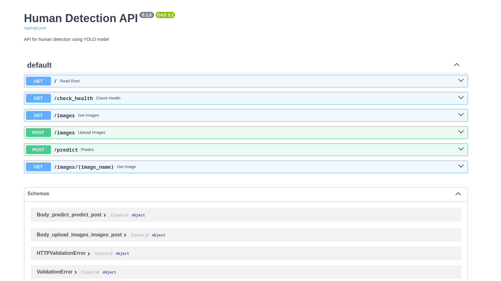
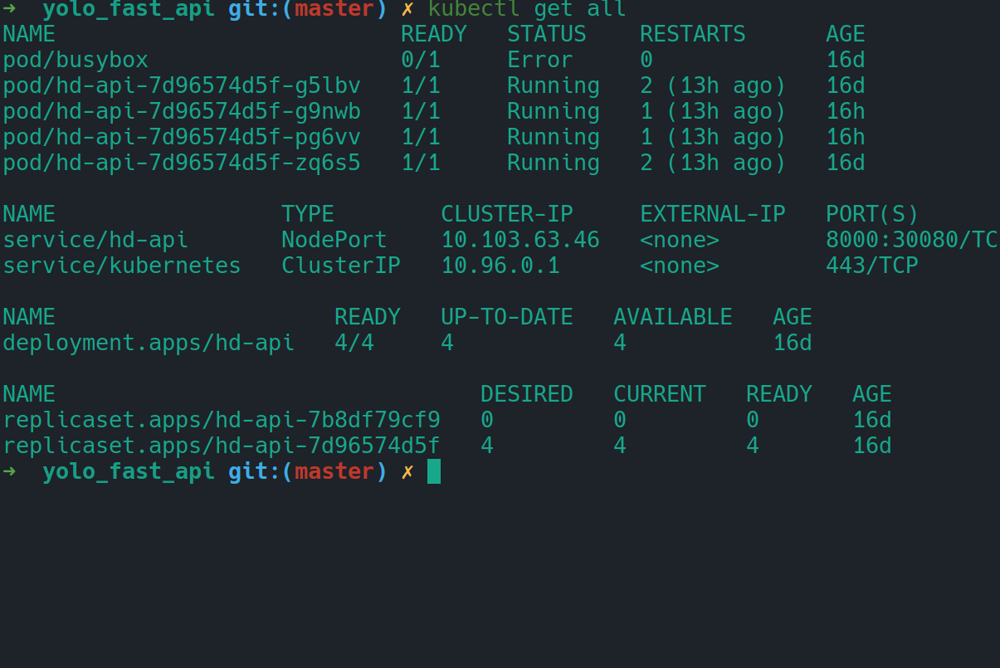

# YOLO Human Detection API

A FastAPI-based REST API for human detection using YOLO (You Only Look Once) object detection model. This API provides endpoints for uploading images, detecting humans, and retrieving detection results with **production-ready Kubernetes deployment on Minikube**.

## Features

- Human detection using YOLO model
- RESTful API endpoints for image processing
- Support for JPEG image uploads
- Automatic image preprocessing and detection visualization
- **Production-ready Kubernetes deployment with Minikube**
- **NodePort service for external access**
- **High availability with 4 replica pods**
- Docker support for containerized deployment
- Configurable detection parameters (confidence threshold, IOU threshold)

## Prerequisites

- Python 3.8+
- **Minikube** (recommended for Kubernetes deployment)
- **kubectl** (for Kubernetes management)
- Docker (for building container images)

## Installation

### 1. Clone the Repository

```bash
git clone https://github.com/aref-hammaslak/yolo_fast_api.git
cd yolo_fast_api
```

### 2. Local Development Setup

```bash
# Create and activate virtual environment
python -m venv .venv
source .venv/bin/activate  # On Windows: .venv\Scripts\activate

# Install dependencies
pip install -r requirements.txt

# Create weights directory and add YOLO model
mkdir -p weights
# Copy your yolo11m.onnx model to weights/
```

## Configuration

The application can be configured through `src/config/config.yaml`:

```yaml
model_path: "weights/yolo11m.onnx"
iou_threshold: 0.5
confidence_threshold: 0.5
classes: ["person"]
image_dir: "images"
plots_dir: "plots"
```

## Deployment

### 🚀 **Kubernetes Deployment with Minikube (Recommended)**

#### 1. Start Minikube

```bash
# Start Minikube with sufficient resources
minikube start --memory=4096 --cpus=2

# Enable necessary addons
minikube addons enable ingress
```

#### 2. Build Docker Image in Minikube

```bash
# Configure Docker to use Minikube's Docker daemon
eval $(minikube docker-env)

# Build the Docker image
docker build -t hd-api:latest .
```

#### 3. Deploy to Kubernetes

```bash
# Apply all Kubernetes configurations
kubectl apply -f kubernetes/

# Verify deployment
kubectl get all
```

#### 4. Access the Application

```bash
# Get Minikube IP
minikube ip
# Expected output: 192.168.49.2 (or similar)

# Access the API documentation
# Open browser: http://192.168.49.2:30080/docs
```
**Screenshot: Access the API documentation**


#### 5. Deployment Verification

**Screenshot: Kubernetes Components**

_All components deployed successfully showing 4 replica pods, service, and deployment_

**Command:**

```bash
kubectl get all
```